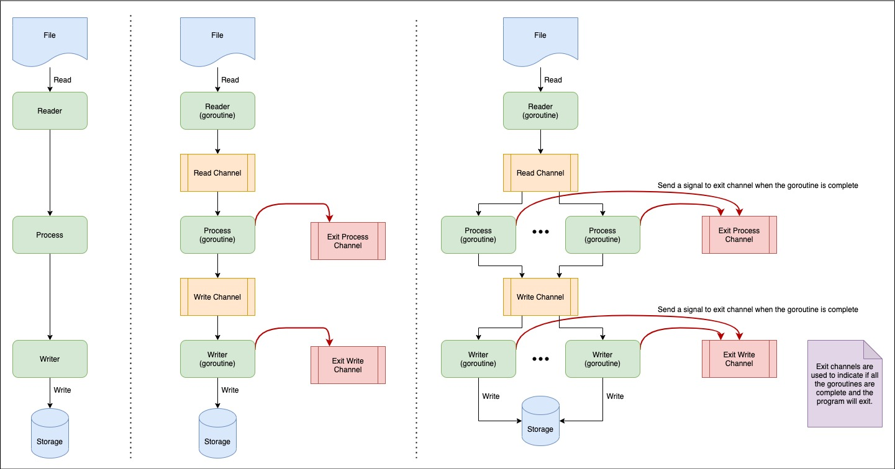

# File Processor in Concurrency Pattern

Implement a file processor solution in concurrency pattern using Golang goroutine.



## Get Started

1. Run `docker-compose up` to start the localstack and redis services.
2. Create a Dynamodb table if the storage is Dynamodb.
    ```
    aws dynamodb create-table --table-name Users --attribute-definitions AttributeName=UUID,AttributeType=S --key-schema AttributeName=UUID,KeyType=HASH --billing-mode PAY_PER_REQUEST --endpoint-url=http://localhost:4566 --profile localstack
    ```
3. There are 3 types of storage services defined, Dynamodb, Redis, and Fake storages. The storage service is injected via this code.
    ```
    writer := &fileprocessor.StorageWriter{
		// Storage: storage.NewDynamodbService(),
		// Storage: storage.NewFakeStorage(),
		Storage: storage.NewRedisService(),
	}
    ```
4. Run `go run main.go --path /path/to/file`

## Tips

Localstack service health checks

```
http://localhost:4566/health?reload
```

Start a Redis cli to connect to the Redis server in docker container.

```
docker run -it --rm \
> --network go-file-processor_app-tier \
> bitnami/redis:6.2.6 redis-cli -h go-file-processor_redis_1
```